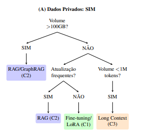
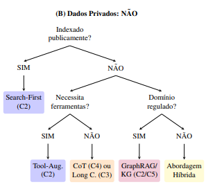
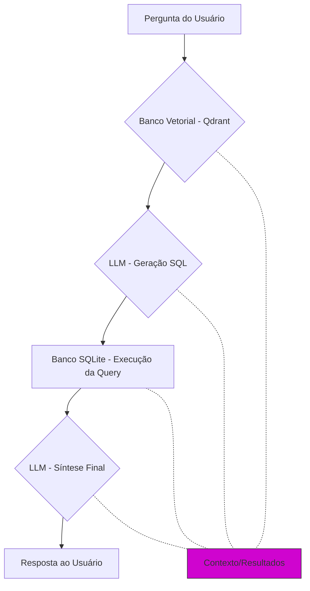

# 🎯 RAG e Suas Alternativas: Um Framework para o Aprimoramento de Grandes Modelos de Linguagem 

## Um Guia de Decisão Prático para Desenvolvedores

[](https://opensource.org/licenses/MIT)
[](https://www.python.org/downloads/)
[](https://www.google.com/search?q=LINK_DO_SEU_ARTIGO)
[](https://www.google.com/search?q=CONTRIBUTING.md)

> Apresentamos um framework prático de decisão para escolher entre RAG e outras técnicas de aprimoramento de Grandes Modelos de Linguagem (LLMs), com foco no contexto brasileiro.

[**Artigo Científico**](https://drive.google.com/file/d/1aMzeUXOVJrcXkTpRxJLBJ6c9-tD00dic/view?usp=sharing) | [**Estudo de Caso**](https://github.com/evellynnicole/FutChat.git) | [**Árvore de Decisão**](https://www.mermaidchart.com/d/669786ad-edbd-4709-8c3f-00de22da399a)

-----

# 📋 Índice

### [1 Visão Geral](#1-visão-geral-1)
  - [**1.1 Sobre o Projeto**](#-11-sobre-o-projeto)
  - [**1.2. Para Quem é Este Repositório**](#12-para-quem-é-este-repositório)

### [2 Guia de Uso Prático](#2-guia-de-uso-prático-1)
  - [**2.1. Quick Start:**](#21-quick-start)
  - [**2.2. Como Usar o Repositório (Guias por Perfil)**](#22--como-usar-o-repositório-por-perfil)
    - [Para Arquitetos de Soluções](#para-arquitetos-de-soluções)
    - [Para Desenvolvedores](#para-desenvolvedores)
    - [Para Pesquisadores](#para-pesquisadores)
    - [Para Estudantes](#para-estudantes)

### [3 Fundamentos da RAG](#3-fundamentos-da-rag-1)

### [4 Contribuições Brasileiras (SBC)](#4-contribuições-brasileiras-sbc-1)

### [5 Taxonomia Temporal: Categorias C1-C5](#5-%EF%B8%8F-taxonomia-temporal-categorias-c1-c5)

### [6 Framework de Decisão](#6-framework-de-decisão-1)
  - [6.1 Árvore de Decisão](#61-árvore-de-decisão)
  - [6.2 Tabela Comparativa Multidimensional](#62-tabela-comparativa-multidimensional)
  - [6.3 Matriz de Adequação Técnica por Cenário](#63-matriz-de-adequação-técnica-por-cenário)

### [7 Estudo de Caso: Chatbot para o Campeonato Brasileiro](#7--estudo-de-caso-chatbot-para-o-campeonato-brasileiro)

### [8 Validação do Framework de Decisão](#8--validação-do-framework-de-decisão-para-aprimoramento-de-llms)

### [9 Bibliografia](#9-bibliografia-1)
    
-----
# 1. Visão Geral

## 🎯 1.1 Sobre o Projeto

### O Desafio

LLMs enfrentam limitações fundamentais:

  - **Conhecimento estático**: informações desatualizadas após o treinamento
  - **Ausência de dados especializados**: sem acesso a informações proprietárias ou de domínio específico
  - **Múltiplas soluções disponíveis**: RAG, Fine-Tuning, Long Context, Tool-Augmented... mas qual escolher?

### A Solução

Este repositório apresenta um **framework prático de decisão** que transforma o debate teórico sobre técnicas de aprimoramento de LLMs em uma ferramenta aplicável, especialmente relevante para a comunidade brasileira de IA.

### Principais Contribuições

✅ **Taxonomia Temporal (C1-C5)**: Classificação organizada das técnicas pelo momento de disponibilização do conhecimento ao modelo

✅ **Árvore de Decisão**: Guia visual para seleção técnica baseada em critérios objetivos

✅ **Matriz de Adequação**: Mapeamento de técnicas por cenários reais de aplicação

✅ **Validação Prática**: Análise comparativa de aplicações reais contra o framework proposto

✅ **Contexto Brasileiro**: Destaque para contribuições da comunidade SBC e aplicações nacionais

## 1.2. Para Quem é Este Repositório

  - **Arquitetos de Soluções**: Decisões fundamentadas sobre qual técnica usar
  - **Desenvolvedores**: Referência prática com código reproduzível
  - **Pesquisadores**: Base consolidada da literatura com foco em contribuições brasileiras
  - **Estudantes**: Material didático estruturado sobre aprimoramento de LLMs

-----

# 2. Guia de Uso Prático

## 2.1⚡ Quick Start

### Descubra Rapidamente Qual Técnica Usar

**Seus dados são privados/proprietários?**

  - ✅ **SIM** → Vá para a [Árvore de Decisão - Ramo A](https://github.com/gdaias/RAG-Alternatives-Framework/blob/main/assets/arvore de decisao/arvore_decisao_A.png)
  - ❌ **NÃO** → Vá para a [Árvore de Decisão - Ramo B](https://github.com/gdaias/RAG-Alternatives-Framework/blob/main/assets/arvore_decisao_B.png)

**Já sabe seu cenário?** Consulte a [Matriz de Adequação por Cenário](https://github.com/gdaias/RAG-Alternatives-Framework/blob/main/assets/matriz de adequacao.png)

**Quer ver na prática?** Explore o [Estudo de Caso: Chatbot do Campeonato Brasileiro de Futebol](https://github.com/evellynnicole/FutChat.git)

### Navegação Rápida por Categoria

| Categoria | O que é | Quando usar | Exemplos |
|-----------|---------|-------------|----------|
| [**C1**](#categoria-1-internalização-de-conhecimento-no-treino) | Internalização de conhecimento no treino (modificação de pesos do modelo) | Conhecimento estável, recursos disponíveis | Fine-Tuning, LoRA, QLoRA |
| [**C2**](#categoria-2-recuperação-de-conhecimento-externo-tempo-real) | Recuperação de conhecimento externo em tempo real | Dados dinâmicos, atualizações frequentes | RAG tradicional, Hybrid Retrieval, GraphRAG, Search-First, Tool-Augmented |
| [**C3**](#categoria-3-expansão-da-janela-de-contexto) | Expansãoo da janela de contexto (no prompt) | Documentos completos, \<1M tokens | Long Context |
| [**C4**](#categoria-4-otimização-do-raciocínio) | Otimização do raciocínio (processamento da informação) | Problemas complexos, sem dados externos, técnica complementar | Chain-of-Thought |
| [**C5**](#categoria-5-protocolos-e-frameworks-de-habilitação) | Protocolos e Frameworks de Habilitação | Infraestrutura de suporte para outras categorias | Knowledge Graphs, Neuro-Simbólico, Model Context Protocol |

## 2.2 🚀 Como Usar o Repositório (por perfil)

### Para Arquitetos de Soluções

**Objetivo**: Escolher a técnica adequada para seu projeto

1.  **Identifique as características do seu problema**

      - Volume de dados a processar
      - Frequência de atualização necessária
      - Requisitos de privacidade
      - Recursos computacionais disponíveis

2.  **Consulte a Árvore de Decisão**

      - Siga o fluxo de perguntas em [Árvore de Decisão Completa](https://www.mermaidchart.com/d/669786ad-edbd-4709-8c3f-00de22da399a)

3.  **Valide com a Matriz de Cenários**

      - Encontre cenários similares em [Matriz de Adequação por Cenário](#63-matriz-de-adequação-técnica-por-cenário)
      - Compare com a [Tabela Comparativa Multidimensional](#62-tabela-comparativa-multidimensional)

4.  **Consulte o Estudo de Caso**

      - Veja implementação prática em [Estudo de Caso: Chatbot do Campeonato Brasileiro de Futebol](https://github.com/evellynnicole/FutChat.git)

### Para Desenvolvedores

**Objetivo**: Implementar a técnica escolhida

1.  **Estude a categoria selecionada**

      - Leia a documentação da categoria (C1-C5)
      - Revise as referências acadêmicas citadas

2.  **Analise o código de exemplo**

      - Explore o estudo de caso em [Estudo de Caso: Chatbot do Campeonato Brasileiro de Futebol](https://github.com/evellynnicole/FutChat.git)
      - Consulte o [TCC completo da Evellyn](http://repositorio.bc.ufg.br//handle/ri/27277)

3.  **Adapte para seu contexto**

      - Use a arquitetura como referência
      - Considere as lições aprendidas documentadas

### Para Pesquisadores

**Objetivo**: Fundamentação teórica e referências

1.  **Revisão bibliográfica**

      - [Fundamentos da RAG](#3--fundamentos-da-rag): artigos seminais
      - [Contribuições Brasileiras](#4--contribuições-brasileiras-sbc): trabalhos SBC

2.  **Framework acadêmico**

      - [Taxonomia conceitual](#5-️-taxonomia-temporal-categorias-c1-c5)
      - Artigo completo em [RAG e Suas Alternativas: Um Framework para o Aprimoramento de Grandes Modelos de Linguagem](https://drive.google.com/file/d/1aMzeUXOVJrcXkTpRxJLBJ6c9-tD00dic/view?usp=sharing)

3.  **Citação do trabalho**

(Adicionar a citação do artigo)

### Para Estudantes

**Objetivo**: Aprendizado estruturado

**Caminho recomendado**:

1.  Comece com [Sobre o Projeto](#-11-sobre-o-projeto)
2.  Leia [Fundamentos da RAG](#3--fundamentos-da-rag)
3.  Explore a [Taxonomia C1-C5](#5-️-taxonomia-temporal-categorias-c1-c5)
4.  Pratique com o [Estudo de Caso](#7--estudo-de-caso-chatbot-para-o-campeonato-brasileiro)
5.  Teste sua compreensão usando o [Framework de Decisão](#6--framework-de-decisão)

-----

# 3 📚 Fundamentos da RAG

### O que é Retrieval-Augmented Generation?

A Geração Aumentada por Recuperação (**RAG**) foi introduzida por Lewis et al. (2020) para superar a limitação de **conhecimento paramétrico estático** dos LLMs. A arquitetura combina um componente de recuperação densa com um modelo generativo, permitindo que o modelo acesse informações atualizadas sem necessidade de retreinamento.

### Arquitetura Original

A RAG fundamenta-se em três componentes principais:

1.  **Indexador**: Processa e armazena representações vetoriais de uma base de conhecimento externa
2.  **Recuperador**: Identifica documentos mais relevantes para uma consulta específica
3.  **Gerador**: Produz respostas utilizando tanto a consulta quanto os documentos recuperados como contexto

### Evolução Arquitetural

#### 2022: Integração Profunda

**RETRO (Retrieval-Enhanced Transformer)** - Borgeaud et al. incorporaram mecanismos de recuperação diretamente na arquitetura do transformer, permitindo acesso a trilhões de tokens.

#### 2023: Otimizações e Especializações

  - **Modelos de embedding especializados** por domínio
  - **Chunking semântico** preservando coerência contextual
  - **Busca híbrida** combinando similaridade semântica com filtros de metadados
  - **In-Context RAL** - Ram et al. propuseram atualização dinâmica via contexto estendido

### 📖 Artigos Seminais

| Ano | Trabalho | Contribuição | Link |
|-----|----------|--------------|------|
| 2020 | **Lewis et al.** - RAG | Arquitetura fundacional da RAG | [NeurIPS 2020](https://arxiv.org/abs/2005.11401) |
| 2021 | **Izacard & Grave** - FiD | Escalabilidade em QA | [TACL 2021](https://arxiv.org/abs/2007.01282) |
| 2022 | **Borgeaud et al.** - RETRO | Integração com transformer | [ICML 2022](https://arxiv.org/abs/2112.04426) |
| 2023 | **Ram et al.** - In-Context RAL | Contexto estendido dinâmico | [arXiv 2023](https://arxiv.org/abs/2302.00083) |
| 2023 | **Shi et al.** - LLM Retrievers | LLMs como recuperadores zero-shot | [arXiv 2023](https://arxiv.org/abs/2304.14233) |

-----

## 4 🇧🇷 Contribuições Brasileiras (SBC)

A partir de 2024, a comunidade acadêmica brasileira demonstrou assimilação e adaptação da RAG ao contexto nacional, com publicações em eventos da Sociedade Brasileira de Computação (**SBC**).

**Domínio Jurídico**

> **Arquiteturas RAG para Documentação Legal**
> - Paranhos et al. (2024) - Avaliação de padrões arquiteturais RAG em domínios jurídicos
>    - [XII ERI-GO 2024](http://repositorio.bc.ufg.br/handle/ri/27276)
>    - Desafios: complexidade terminológica e hierarquias normativas brasileiras

> **Extração Automatizada de Dados Legais**
> - Aquino et al. (2024) - 90% de precisão em identificação de elementos jurídicos
>   - [SBBD 2024](https://sol.sbc.org.br/index.php/sbbd_estendido/article/view/31268)

**Domínio Educacional**

> **Questões Multimodais do ENEM**
> - Taschetto & Fileto (2024) - RAG para processamento texto-imagem
>   - [SBBD 2024](https://sol.sbc.org.br/index.php/sbbd/article/view/30233)
>   - Relevância: especificidade cultural e linguística do sistema educacional brasileiro

> **Assistentes Virtuais Institucionais**
> - Kuratomi et al. (2024) - Aumento de precisão de 13,68% para 54,02%
>   - [ENIAC 2024](https://sol.sbc.org.br/index.php/eniac/article/view/31884)
> - Souza et al. (2024) - IFBot para instituições educacionais
>   - [WICS 2024](https://sol.sbc.org.br/index.php/wics/article/view/31611)

**Contribuições Metodológicas**

> - Souza et al. (2024) - TableRAG
>   - [STIL 2024](https://sol.sbc.org.br/index.php/stil/article/view/31349)
>   - 86,7% eficácia em recuperação | 74% acurácia em QA sobre tabelas
>   - Pipeline especializado para dados tabulares
    
**Estudos Comparativos**
> - da Costa et al. (2024) - Comparação Fine-Tuning vs RAG para tarefas em português
>   - [STIL 2024](https://sol.sbc.org.br/index.php/stil/article/view/31350)

**Implementação Local**
> - Rocha & Pessoa (2024) - Análise crítica de limitações em LLMs locais
>   - [ENIAC 2024](https://sol.sbc.org.br/index.php/eniac/article/view/31880)
>   - Foco: soberania tecnológica no contexto brasileiro

**Aplicações Empresariais**
> - Siqueira et al. (2024) - Integração de dados estruturados em chatbots empresariais
>   - [STIL 2024](https://sol.sbc.org.br/index.php/stil/article/view/31348)

-----

## 5 🗂️ Taxonomia Temporal: Categorias C1-C5

A classificação organiza as técnicas de aprimoramento segundo o **momento em que o conhecimento é disponibilizado ao modelo**, estruturadas em uma linha temporal do treinamento à infraestrutura de suporte.


### Categoria 1: Internalização de Conhecimento (no Treino)

**Momento**: Modificação dos pesos do modelo antes da inferência

Técnicas que incorporam conhecimento de forma permanente através do ajuste de parâmetros.

| Técnica | Descrição | Quando Usar |
|---------|-----------|-------------|
| **Fine-Tuning Completo** | Retreinamento de todos os parâmetros | Especialização profunda com recursos abundantes |
| **LoRA** (Low-Rank Adaptation) | Adaptação de baixo rank, modificando subconjuntos | Especialização eficiente com recursos limitados |
| **QLoRA** (Quantized LoRA) | LoRA com quantização para ainda mais eficiência | Dispositivos edge ou ambientes com restrições severas |

**Vantagens**

  - ✅ Independência de infraestrutura externa na inferência
  - ✅ Latência reduzida (sem busca em tempo real)
  - ✅ Privacidade total dos dados

**Limitações**

  - ❌ Custos elevados para atualizações frequentes
  - ❌ Risco de catastrophic forgetting
  - ❌ Inadequado para informações altamente dinâmicas

**Referências**: [Howard & Ruder, 2018](https://arxiv.org/abs/1801.06146) | [Hu et al., 2022](https://arxiv.org/abs/2106.09685) | [Dettmers et al., 2023](https://arxiv.org/abs/2305.14314)


### Categoria 2: Recuperação de Conhecimento Externo (Tempo Real)

**Momento**: Acesso a fontes externas durante a inferência

Paradigma "just-in-time knowledge" - a categoria mais ampla da taxonomia.

| Técnica | Descrição | Caso de Uso Ideal |
|---------|-----------|-------------------|
| **RAG Tradicional** | Recuperação densa + geração contextual | Bases internas extensas, atualizações frequentes |
| **Hybrid Retrieval** | Busca densa (semântica) + esparsa (BM25) | Máxima cobertura e precisão em grandes volumes |
| **GraphRAG** | Integração com grafos de conhecimento | Navegação relacional e raciocínio multi-hop |
| **Search-First** | APIs de busca externa direta | Informações públicas, sem infraestrutura própria |
| **Tool-Augmented** | LLM chama ferramentas especializadas | Acesso a APIs, calculadoras, bancos de dados |
| **Neuro-Simbólico** | Recuperação neural + raciocínio simbólico | Domínios que exigem garantias lógicas formais |

**Vantagens**

  - ✅ Máxima flexibilidade para dados dinâmicos
  - ✅ Atualização sem retreinamento
  - ✅ Acesso a conhecimento especializado sob demanda

**Limitações**

  - ❌ Complexidade operacional
  - ❌ Dependência de infraestrutura externa
  - ❌ Latência adicional na recuperação

**Referências**: [Lewis et al., 2020](https://arxiv.org/abs/2005.11401) | [Ma et al., 2021](https://arxiv.org/abs/2104.08663) | [Edge et al., 2024](https://arxiv.org/abs/2404.16130) | [Qin et al., 2023](https://arxiv.org/abs/2307.16789)


### Categoria 3: Expansão da Janela de Contexto

**Momento**: Fornecimento do conhecimento completo no prompt

Abordagem de "força bruta" viabilizada por avanços arquiteturais recentes.

| Subcategoria | Descrição | Exemplo |
|--------------|-----------|---------|
| **C3A - Expansão Passiva** | Usuário fornece manualmente todo o contexto | Upload de documentos completos |
| **C3B - Expansão Ativa** | Modelo gerencia contexto automaticamente | Sistemas emergentes com gerenciamento autônomo |

**Modelos Disponíveis**: Gemini 1.5 (1M+ tokens), Claude (1M+ tokens)

**Vantagens**

  - ✅ Simplicidade arquitetural (sem chunking)
  - ✅ Compreensão holística de documentos
  - ✅ Sem infraestrutura de recuperação

**Limitações**

  - ❌ Volume total limitado pela janela
  - ❌ Custos elevados por token
  - ❌ Inadequado para bases massivas (\>1M tokens)


### Categoria 4: Otimização do Raciocínio

**Momento**: Durante a inferência, na estruturação do prompt

Técnicas que melhoram o processamento da informação existente, sem adicionar conhecimento novo.

| Técnica | Descrição | Aplicação Ideal |
|---------|-----------|-----------------|
| **Chain-of-Thought (CoT)** | Raciocínio passo a passo explícito | Problemas matemáticos e lógicos complexos |
| **Prompting Avançado** | Estruturação estratégica de instruções | Decomposição de tarefas complexas |

**Vantagens**

  - ✅ Baixo custo de implementação
  - ✅ Sem infraestrutura adicional
  - ✅ Complementar a outras categorias

**Limitações**

  - ❌ Limitado ao conhecimento paramétrico
  - ❌ Não resolve obsolescência de dados

**Referências**: [Wei et al., 2022](https://arxiv.org/abs/2201.11903)


### Categoria 5: Protocolos e Frameworks de Habilitação

**Momento**: Define a infraestrutura sobre a qual o sistema opera

Não são técnicas de aprimoramento direto, mas habilitam outras categorias.

| Protocolo | Função | Habilita |
|-----------|--------|----------|
| **Knowledge Graphs** | Ontologias formais com garantias lógicas | GraphRAG, Neuro-Simbólico |
| **Model Context Protocol (MCP)** | Descoberta e uso autônomo de ferramentas | Tool-Augmented Generation em escala |

**Características**

  - 🔧 Infraestrutura de suporte
  - 🔧 Auditabilidade e rastreabilidade
  - 🔧 Padronização de interfaces

**Referências**: [Ji et al., 2022](https://ieeexplore.ieee.org/document/9416312)

-----

## 6 🎯 Framework de Decisão

### 6.1 Árvore de Decisão

[**Árvore de Decisão Completa**](https://www.mermaidchart.com/d/669786ad-edbd-4709-8c3f-00de22da399a)
A árvore orienta a seleção técnica através de perguntas sequenciais sobre características fundamentais do problema:

**Ramo A - Dados Privados/Proprietários**



**Ramo B - Dados Públicos**



### 6.2 Tabela Comparativa Multidimensional

| Cat. | Técnica | Volume | Freq. Atual. | Privacidade | Recursos | Latência | Orçamento | Expertise |
| :--- | :--- | :--- | :--- | :--- | :--- | :--- | :--- | :--- |
| C1 | Fine-tuning | M-G | Baixa | Total | Alto | Baixa | Alto | Alto |
| | LoRA/QLoRA | P-M | Baixa | Total | Médio | Baixa | Médio | Médio |
| C2 | RAG Tradicional | Grande | Alta | Configurável | M-A | Média | M-A | Médio |
| | Hybrid Retrieval| Grande | Alta | Configurável | Alto | Média | Alto | Alto |
| | GraphRAG | M-G | Média | Configurável | Alto | Alta | Alto | Alto |
| | Search-First | Ilimitado\* | Máxima | Limitada | Baixo | Média | Baixo-M | Baixo |
| | Tool-Augmented | Configurável | Alta | Configurável | Médio | Variável | Médio | M-A |
| C3 | Long Context | Pequeno\*\* | N/A\*\*\* | Variável | M-A | Média-A | Alto | Baixo-M |
| C4 | Chain-of-Thought | N/A\*\*\*\* | N/A\*\*\*\* | Total | Baixo | Baixa | Baixo | Baixo-M |
| C5 | Knowledge Graphs | M-G | Baixa-M | Total | Médio | Baixa | Alto | Alto |
| | Neuro-Simbólico | Médio | Baixa | Total | Muito Alto | Média-A | Muito Alto| Muito Alto|


**Legenda:** P=Pequeno (<1GB), M=Médio (1GB-100GB), G=Grande (>100GB), A=Alto, M-A=Médio-Alto, M-G=Médio-Grande.
- **\*** Limitado apenas por disponibilidade pública de informações.
- **\*\*** Limitado à janela de contexto (tipicamente <1M tokens).
- **\*\*\*** Atualização depende da fonte de contexto fornecida.
- **\*\*\*\*** Opera sobre conhecimento paramétrico existente.


### 6.3 Matriz de Adequação Técnica por Cenário

| Cenário de Aplicação | Técnica Primária | Justificativa | Alternativas Complementares |
|---------------------|------------------|---------------|----------------------------|
| **Suporte ao Cliente** | RAG Tradicional (C2) | Bases internas extensas requerem precisão factual e atualização dinâmica | Tool-Augmented (C2) para integração com CRM e sistemas transacionais |
| **Conformidade Regulatória** | GraphRAG (C2) | Navegação em hierarquias normativas com rastreabilidade de fontes legais | Fine-tuning (C1) quando terminologia é específica e estável |
| **Pesquisa Acadêmica** | Hybrid Retrieval (C2) | Maximiza cobertura e precisão em grandes volumes de literatura | Long Context (C3) para análise holística de artigos individuais |
| **Desenvolvimento de Software** | Tool-Augmented (C2) | Integração com ferramentas especializadas (linters, testes, docs) | RAG Tradicional (C2) para repositórios com patterns específicos |
| **Aplicações Mobile/Edge** | LoRA/QLoRA (C1) | Execução local eficiente com recursos limitados e privacidade | Chain-of-Thought (C4) para raciocínio sem infraestrutura adicional |
| **Análise de Documentos Legais** | GraphRAG (C2) | Hierarquias normativas brasileiras complexas | Knowledge Graphs (C5) para auditabilidade completa |
| **Chatbots Educacionais** | RAG Tradicional (C2) | Conteúdo institucional dinâmico, atualizações frequentes | Long Context (C3) para materiais didáticos extensos |
| **Assistentes Médicos** | Neuro-Simbólico (C2) | Garantias lógicas formais, rastreabilidade de raciocínio | GraphRAG (C2) para bases de conhecimento médico |

-----

## 7 🔬 Estudo de Caso: Chatbot para o Campeonato Brasileiro

### Contexto e Motivação

**Domínio**: Campeonato Brasileiro de Futebol Série A

**Objetivo**: Fornecer respostas precisas sobre partidas, estatísticas de jogadores e classificações em tempo real.

**Desafios Identificados**:

1.  Dados inerentemente dinâmicos (atualizações diárias/semanais)
2.  Informações estruturadas em formato tabular (artilharia, resultados, classificações)
3.  Conhecimento paramétrico dos LLMs não inclui eventos recentes
4.  Dados tabulares não são nativos ao conhecimento dos modelos

### Decisão Arquitetural

**Técnica Escolhida**: Tool-Augmented RAG (Categoria C2) - Padrão Text-to-SQL

**Justificativa pela Taxonomia**:

  - ✅ Dados estruturados (SQL) + dinâmicos (atualizações frequentes) → C2
  - ✅ Necessidade de acesso a ferramentas especializadas (banco de dados)
  - ✅ Precisão factual crítica (estatísticas esportivas)

### Arquitetura Implementada



### Componentes Técnicos

**1. Banco de Dados Vetorial (Qdrant)**

Armazena três tipos de informações recuperáveis:

  - **Esquemas de Tabelas**: Trechos dos `CREATE TABLE` relevantes
  - **Documentação Semântica**: Descrições em linguagem natural de tabelas e colunas
  - **Exemplos Few-Shot**: Pares "pergunta-SQL" validados

**2. Pipeline de Recuperação**

```python
# Exemplo conceitual do fluxo
pergunta = "Quem fez mais gols no Brasileirão?"

# Busca vetorial retorna:
contexto = {
    "esquema": "CREATE TABLE artilharia (jogador TEXT, gols INTEGER, ...)",
    "docs": "A tabela artilharia contém estatísticas de gols por jogador",
    "exemplos": [
        {"Q": "Quantos gols tem o Pedro?", "SQL": "SELECT gols FROM..."}
    ]
}

# LLM gera SQL contextualizado
sql_gerado = llm.generate(pergunta, contexto)
```

**3. Validação e Resultados**

Dataset de validação contendo:

  - Perguntas em linguagem natural
  - SQL de referência correspondente
  - Resultado esperado

**Dificuldades Iniciais**:

  - ❌ Lógica temporal complexa (datas)
  - ❌ Sequências (vitórias consecutivas)
  - ❌ Perguntas compostas

**Melhorias Implementadas**:

  - ✅ Enriquecimento do banco vetorial com mais exemplos
  - ✅ Documentação detalhada de casos edge
  - ✅ Geração de SQL idêntico ao de referência para perguntas diversas

**Alinhamento com o Framework**

| Critério | Avaliação | Confirmação da Escolha |
|---------|-----------|------------------------|
| Volume de Dados | Médio (tabelas estruturadas) | ✅ C2 adequado |
| Frequência de Atualização | Alta (jogos semanais) | ✅ C2 necessário |
| Privacidade | Dados públicos | ✅ C2 sem restrições |
| Recursos Computacionais | Médios | ✅ RAG mais eficiente que Fine-tuning |
| Latência | Média aceitável | ✅ Tool-Augmented viável |
| Especialização | Domínio específico mas dinâmico | ✅ C2 \> C1 (dados mudam constantemente) |

**Código e Documentação Completa**

O desenvolvimento completo deste estudo de caso está documentado no trabalho de conclusão de curso:

ROSA, Evellyn Nicole Machado. Automatização de consultas SQL com Retrieval-Augmented Generation (RAG): uma abordagem para a conversão de texto aplicada a dados do campeonato brasileiro. 2025. 99 f. Trabalho de Conclusão de Curso (Bacharelado em Inteligência Artificial) - Instituto de Informática, Universidade Federal de Goiás, Goiânia, 2024.

📄 [Acesso ao TCC Completo](https://repositorio.bc.ufg.br/items/2aec1425-bf78-41b7-b559-dd95078aebc4) | 🔗 [Repositório de Código](https://github.com/evellynnicole/FutChat.git)

**Lições Aprendidas**

  - **Tool-Augmented RAG é eficaz para dados estruturados dinâmicos**

      - Combina flexibilidade da RAG com precisão de consultas estruturadas

  - **Qualidade da recuperação é crítica**

      - Exemplos few-shot e documentação semântica melhoram significativamente a geração

  - **Validação iterativa é essencial**

      - Dataset de validação permitiu identificar e corrigir casos edge

  - **Framework confirmado na prática**

      - Decisão por C2 (Tool-Augmented) alinhada com características do problema

-----
## 8 Validação do Framework de Decisão para Aprimoramento de LLMs

### Tabela de Validação: Aplicações Relatadas versus Recomendações do Framework

| Origem | Domínio | Técnica Aplicada | Técnica Sugerida pelo Framework | Análise e Alternativas |
|--------|---------|------------------|--------------------------------|------------------------|
| **Estudo de Caso (Seção 3)** | Campeonato Brasileiro de Futebol | Tool-Augmented RAG (Text-to-SQL) | **✓ Tool-Augmented RAG (C2)** | **ALINHAMENTO PERFEITO**<br>- Dados estruturados (SQLite)<br>- Alta frequência de atualização (semanal)<br>- Recursos limitados<br>- Dados proprietários<br>**Alternativas consideradas:**<br>1. RAG Tradicional: Inadequada para dados tabulares complexos<br>2. Fine-tuning (C1): Custos proibitivos para atualizações semanais<br>3. Long Context (C3): Ineficiente para consultar banco de dados completo |
| **Paranhos et al. (2024)** | Jurídico - Documentação Legal Brasileira | RAG (arquiteturas variadas) | **GraphRAG (C2)** ou **Hybrid Retrieval (C2)** | **ALINHAMENTO PARCIAL**<br>- Complexidade terminológica jurídica<br>- Hierarquias normativas complexas<br>**Framework sugere evolução:**<br>1. **GraphRAG**: Ideal para navegação em hierarquias legais e rastreabilidade<br>2. **Hybrid Retrieval**: Maximiza precisão com termos técnicos específicos<br>3. Fine-tuning complementar (C1) para terminologia estável |
| **Aquino et al. (2024)** | Jurídico - Extração de Dados Legais | RAG | **RAG Tradicional (C2)** com **Tool-Augmented (C2)** | **ALINHAMENTO BOM**<br>- Precisão de 90% alcançada<br>- Tarefa de extração estruturada<br>**Framework sugere complemento:**<br>1. Tool-Augmented para estruturação automática de elementos jurídicos<br>2. GraphRAG para relações entre normas<br>3. Manter RAG base pela eficácia demonstrada |
| **Taschetto & Fileto (2024)** | Educacional - ENEM Multimodal | RAG | **RAG Tradicional (C2)** + **Long Context (C3)** | **ALINHAMENTO BOM**<br>- Conteúdo multimodal (texto + imagem)<br>- Questões contextualizadas<br>**Framework sugere híbrido:**<br>1. RAG para base de conhecimento ENEM<br>2. Long Context (C3) para questões longas com múltiplos elementos<br>3. Chain-of-Thought (C4) complementar para raciocínio em questões complexas |
| **Kuratomi et al. (2024)** | Chatbot Institucional | RAG | **✓ RAG Tradicional (C2)** | **ALINHAMENTO PERFEITO**<br>- Aumento de precisão: 13,68% → 54,02%<br>- Base de conhecimento institucional<br>- Atualizações frequentes<br>**Validação do Framework:**<br>1. Dados privados institucionais<br>2. Necessidade de atualização contínua<br>3. Recursos limitados (contexto institucional)<br>**Melhoria sugerida:** Hybrid Retrieval para consultas ambíguas |
| **Souza et al. (2024b)** | Assistente Virtual Educacional (IFBot) | RAG | **✓ RAG Tradicional (C2)** | **ALINHAMENTO PERFEITO**<br>- Contexto educacional institucional<br>- Base de conhecimento específica<br>**Framework confirma escolha:**<br>1. Privacidade de dados institucionais<br>2. Atualizações periódicas (calendário, normas)<br>3. Custo-benefício adequado |
| **Siqueira et al. (2024)** | Chatbot Empresarial com Dados Estruturados | RAG (com integração de dados estruturados) | **Tool-Augmented RAG (C2)** | **ALINHAMENTO PARCIAL**<br>- Dados estruturados empresariais<br>**Framework sugere especialização:**<br>1. **Tool-Augmented**: Melhor para integração com sistemas transacionais (CRM, ERP)<br>2. Text-to-SQL para consultas em bancos relacionais<br>3. Manter RAG para documentação não-estruturada |
| **Rocha & Pessoa (2024)** | RAG em LLMs Locais | RAG (implementação local) | **LoRA/QLoRA (C1)** ou **RAG Local (C2)** | **CONTEXTO ESPECÍFICO**<br>- Soberania tecnológica<br>- Recursos limitados<br>**Framework oferece trade-offs:**<br>1. **LoRA/QLoRA (C1)**: Se conhecimento é estável e privacidade é crítica<br>2. **RAG Local (C2)**: Se atualizações são necessárias<br>3. Considerar custo de manutenção de infraestrutura local |
| **Souza et al. (2024a) - TableRAG** | Processamento de Dados Tabulares | RAG especializado (TableRAG) | **✓ Tool-Augmented RAG (C2)** | **INOVAÇÃO VALIDADA**<br>- Pipeline especializado para tabelas<br>- 86,7% eficácia em recuperação<br>- 74% acurácia em QA<br>**Framework confirma:**<br>1. Tool-Augmented é categoria correta<br>2. TableRAG representa especialização bem-sucedida<br>3. Aplicável a cenários similares ao Estudo de Caso (Seção 3) |

## Análise Consolidada da Validação

### Métricas de Alinhamento

- **Alinhamento Perfeito**: 4 casos (44%)
- **Alinhamento Bom/Parcial**: 4 casos (44%)
- **Contexto Específico**: 1 caso (11%)

### Insights da Validação

#### 1. **Predominância da Categoria C2**
Todos os casos relatados utilizam técnicas da Categoria 2 (Recuperação em Tempo Real), validando a observação do artigo sobre a prevalência da RAG na literatura brasileira recente.

#### 2. **Framework sugere especializações relevantes**
Em 5 dos 9 casos, o Framework sugere evoluções ou especializações que poderiam melhorar os resultados:
- GraphRAG para domínio jurídico (navegação hierárquica)
- Tool-Augmented para dados estruturados empresariais
- Hybrid Retrieval para maximizar precisão

#### 3. **Validação de escolhas técnicas**
O Framework valida as escolhas feitas em 4 casos (Estudo de Caso, Kuratomi, Souza IFBot, TableRAG), demonstrando que as decisões estavam alinhadas com os critérios propostos.

#### 4. **Ausência de outras categorias**
Nenhum trabalho brasileiro relatado utilizou:
- **C1 (Fine-tuning)**: Possivelmente devido aos altos custos
- **C3 (Long Context)**: Tecnologia emergente em 2024
- **C4 (Chain-of-Thought)**: Geralmente usada como complemento
- **C5 (Knowledge Graphs)**: Complexidade de implementação

### Recomendações Práticas Emergentes

#### Para Domínio Jurídico:
**Trajetória de Evolução:** RAG Básico → GraphRAG → Neuro-Simbólico
- Começar com RAG para validação rápida
- Evoluir para GraphRAG quando hierarquias normativas forem críticas
- Considerar sistemas neuro-simbólicos para raciocínio formal rigoroso

#### Para Dados Estruturados:
**Padrão Recomendado:** Tool-Augmented RAG (Text-to-SQL ou equivalente)
- Validado pelo Estudo de Caso e TableRAG
- Superior à RAG tradicional para consultas complexas em tabelas
- Permite aproveitamento de índices e otimizações de banco de dados

#### Para Contexto Institucional/Educacional:
**Padrão Recomendado:** RAG Tradicional com possível Hybrid Retrieval
- Custo-benefício adequado
- Facilita atualizações frequentes
- Privacidade controlável

## Limitações da Validação

1. **Viés temporal**: Todos os trabalhos são de 2024, refletindo tecnologias disponíveis naquele momento
2. **Viés geográfico**: Foco em aplicações brasileiras pode não representar cenários globais
3. **Ausência de métricas comparativas**: Poucos trabalhos comparam múltiplas técnicas
4. **Falta de análise de falhas**: Casos onde RAG não funcionou bem não são relatados

## Conclusão da Validação

O Framework proposto demonstra **alta aplicabilidade prática** ao:
1. **Validar** 44% das escolhas técnicas realizadas
2. **Sugerir melhorias relevantes** em 44% dos casos
3. **Identificar padrões** por domínio de aplicação
4. **Oferecer trajetórias de evolução** técnica

A validação confirma a hipótese central do trabalho: **não existe solução universalmente superior**, e a escolha adequada depende fundamentalmente das características específicas do problema.


### 9 Bibliografia

  * Aquino, I. V. d., Santos, M. M. d., Dorneles, C. F., and Carvalho, J. T. (2024). *Extracting information from brazilian legal documents with retrieval augmented generation.*
  * Borgeaud, S. et al. (2022). *Improving language models by retrieving from trillions of tokens.*
  * da Costa, L. Y. et al. (2024). *A comparative study of fine-tuning and rag strategies for portuguese qa tasks.*
  * Howard, J. and Ruder, S. (2018). *Universal language model fine-tuning for text classification.*
  * Kuratomi, G., Pirozelli, P., Cozman, F., and Peres, S. M. (2024). *A rag-based institutional assistant.*
  * Lewis, P. et al. (2020). *Retrieval-augmented generation for knowledge-intensive nlp tasks.*
  * Paranhos, S. L. et al. (2024). *Avaliação do impacto de diferentes padrões arquiteturais rag em domínios jurídicos.*
  * Souza, E. A. d. et al. (2024a). *Tablerag: A novel approach for augmenting Ilms with information from retrieved tables.*
  * Taschetto, L. d. C. and Fileto, R. (2024). *Using retrieval-augmented generation to improve performance of large language models on the brazilian university admission exam (enem).*
  * Wei, J. et al. (2022). *Chain-of-thought prompting elicits reasoning in large language models.*
