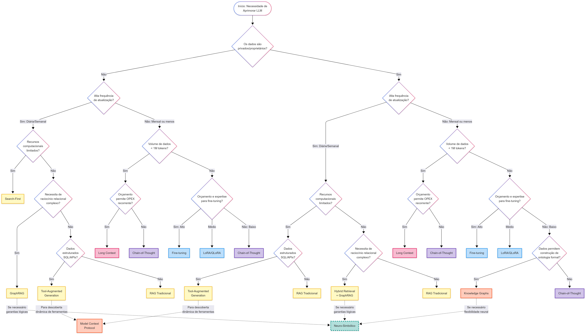

# RAG-Alternatives-Framework
**Framework de Decisão Prático (RAG e Alternativas)**

Apresentamos o repositório com materiais utilizados e gerados pelo artigo "RAG e Suas Alternativas: Um Framework para o Aprimoramento de Grandes Modelos de Linguagem".

Aqui você encontra mais informações sobre:
* Taxonomia Temporal (C1-C5)
* Árvore de Decisão (Framework)
* Matriz de Cenários de Aplicação
* Estudos de caso ("Chatbot para o Campeonato Brasileiro de Futebol" e "Sistema RAG para Análise de Reações Químicas")

Este guia auxilia desenvolvedores na escolha da melhor técnica de aprimoramento de LLMs (*RAG, Fine-Tuning, Tool-Augmented, etc.*) considerando as necessidades e restrições específicas do contexto brasileiro.

---

## 📁 Estrutura do Repositório (Setup)

* **`assets/`**: Imagens e gráficos (ex: Árvore de Decisão).
* **`case_studies/`**: Códigos e notebooks dos Estudos de Caso.
* **`framework_materials/`**: Documentos de apoio (Taxonomia detalhada, PDF de Alternativas).

---

## 📚 A RAG e Seus Fundamentos: Pesquisa Bibliográfica (Seção A)

### Conceitos Seminais e Evolução Arquitetural

A Geração Aumentada por Recuperação (**RAG**) foi introduzida por **Lewis et al. (2020)[cite_start]** [cite: 16, 212, 213] [cite_start]para lidar com a limitação de **conhecimento paramétrico estático** dos LLMs[cite: 12]. [cite_start]A arquitetura original da RAG combina um componente de **recuperação densa** com um modelo generativo *seq2seq*[cite: 30].

A RAG evoluiu com:
* **RETRO** (*Retrieval-Enhanced Transformer*) de Borgeaud et al. (2022)[cite_start], que incorpora a recuperação diretamente na arquitetura do *transformer*[cite: 39, 41, 194, 195].
* [cite_start]Modelos de **embedding** mais sofisticados, estratégias de **chunking** semanticamente orientadas, e bases de dados vetoriais com **busca híbrida**[cite: 43, 44, 45].
* [cite_start]Novas abordagens como os *In-Context Retrieval-Augmented Language Models* (Ram et al., 2023), que permitem a atualização dinâmica de modelos com contexto estendido[cite: 47, 48, 223].

### Adoção e Contribuições Brasileiras (SBC)

[cite_start]A partir de 2024, a comunidade acadêmica brasileira, com trabalhos publicados em eventos da **Sociedade Brasileira de Computação (SBC)**, demonstrou a assimilação e adaptação da RAG ao contexto nacional[cite: 50, 178].

* [cite_start]**Domínio Jurídico:** Investigação de arquiteturas RAG para consultas em documentação legal brasileira (Paranhos et al., 2024 [cite: 51, 218, 219, 220][cite_start]) e extração automatizada de dados legais (Aquino et al., 2024 [cite: 52, 53, 191, 192, 193]).
* [cite_start]**Domínio Educacional:** Aplicação em questões multimodais do ENEM (Taschetto e Fileto, 2024 [cite: 55, 234, 235][cite_start]) e em assistentes virtuais institucionais, como o *IFBot* (Souza et al., 2024 [cite: 59, 231, 232, 233]).
* [cite_start]**Contribuições Metodológicas:** Destaque para o **TableRAG** (Souza et al., 2024), um *pipeline* especializado para o processamento de dados tabulares [cite: 63, 64, 229, 230][cite_start], e estudos comparativos entre Fine-Tuning e RAG (da Costa et al., 2024 [cite: 61, 196, 197]).

---

## 🔑 Estrutura Principal do Framework

### 1. Taxonomia Temporal: Categorias de Aprimoramento (C1-C5)

[cite_start]A classificação organiza as técnicas de acordo com o **momento em que o conhecimento é disponibilizado** ao modelo[cite: 97, 98, 180].

| Cat. | Nome | Momento de Disponibilização | Técnicas Chave |
| :--- | :--- | :--- | :--- |
| **C1** | Internalização de Conhecimento | Modificação dos pesos do modelo antes da inferência | [cite_start]Fine-Tuning (Howard & Ruder 2018), LoRA/QLORA (Hu et al. 2022, Dettmers et al. 2023) [cite: 105, 106, 107, 198, 203, 204, 205] |
| **C2** | Recuperação de Conhecimento Externo | Acesso a fontes externas em Tempo Real/Inferência | RAG Tradicional, Hybrid Retrieval, GraphRAG, Tool-Augmented |
| **C3** | Expansão da Janela de Contexto | Fornecimento do conhecimento completo no *prompt* | Long Context Models (>1M tokens) |
| **C4** | Otimização do Raciocínio | Melhora do processamento da informação existente | [cite_start]Chain-of-Thought (CoT) (Wei et al. 2022) [cite: 129, 130, 236, 237] |
| **C5** | Protocolos e Frameworks de Habilitação | Infraestrutura de suporte que viabiliza outras categorias | Knowledge Graphs (KG), Model Context Protocol (MCP) |

### 2. Árvore de Decisão

*(Lembre-se de salvar a imagem do Drive na pasta* `assets/` *e usar o link relativo abaixo)*

### 3. Matriz de Adequação Técnica por Cenário

*(Mantenha a Tabela 2 do seu artigo aqui)*

| Cenário de Aplicação | Técnica Primária | Justificativa e Opções |
| :--- | :--- | :--- |
| **Suporte ao Cliente** | RAG Tradicional (C2) | [cite_start]Bases internas extensas requerem RAG para precisão factual e atualização dinâmica. [cite: 185] |
| **Conformidade Regulatória** | GraphRAG (C2) | [cite_start]Navegação em hierarquias normativas complexas com rastreabilidade de fontes legais. [cite: 185] |
| **Aplicações Mobile/Edge** | LORA/QLORA (C1) | [cite_start]Execução local eficiente com recursos limitados e preservação de privacidade. [cite: 185] |

---

## 🔍 Validação Prática e Casos (Seção 2)

[cite_start]A Tabela abaixo valida a escolha técnica do Framework contra aplicações documentadas (incluindo os Estudos de Caso)[cite: 182].

| Origem (Artigo/EC) | Aplicação | Técnica Aplicada | Técnica Sugerida pelo Framework | Análise de Convergência |
| :--- | :--- | :--- | :--- | :--- |
| **EC 1** | Chatbot Futebol | [cite_start]Tool-Augmented RAG (C2) [cite: 72] | Tool-Augmented RAG (C2) | Convergência. Uso justificado por dados estruturados e dinâmicos. |
| **EC 2** | Análise Química (ORD) | [cite_start]RAG Avançado (C2) [cite: 82] | RAG/GraphRAG (C2) | Convergência. [cite_start]Escolha da RAG justificada por necessidade de atualizações frequentes e recursos limitados[cite: 80, 81]. |
| **Artigo Aquino et al. (2024)** | Extração Legal | [cite_start]RAG [cite: 52] | GraphRAG/KG (C2/C5) | Divergência. [cite_start]O Framework sugere GraphRAG para rastreabilidade em domínios regulados[cite: 185, 169]. |
| **...** | *[Adicione mais exemplos do seu artigo]* | **...** | **...** | **...** |

---

## 🔬 Estudos de Caso

[cite_start]Validação da versatilidade da RAG em domínios que exigem **dados atualizados, dinâmicos e especializados**[cite: 90, 91].

1.  [cite_start]**Chatbot para o Campeonato Brasileiro de Futebol:** Aplicação de **Tool-Augmented RAG** (padrão Text-to-SQL) para lidar com dados estruturados e em tempo real[cite: 70, 72]. O código pode ser encontrado na pasta **`case_studies/`**.
2.  [cite_start]**Sistema RAG para Análise de Reações Químicas:** Utilização de **RAG Avançado** em um domínio altamente especializado (ORD), justificada pela necessidade de atualizações frequentes e limitação de recursos computacionais[cite: 78, 80, 81, 82]. O código pode ser encontrado na pasta **`case_studies/`**.

---

## 🔗 Referências

Este repositório serve como material de apoio e detalhamento para o artigo:

**RAG e Suas Alternativas: Um Framework para o Aprimoramento de Grandes Modelos de Linguagem**

* **Link para o Artigo Completo **

### Bibliografia Chave Utilizada

* Aquino, I. V. d., Santos, M. M. d., Dorneles, C. F., and Carvalho, J. T. (2024). [cite_start]*Extracting information from brazilian legal documents with retrieval augmented generation.* [cite: 191, 192, 193]
* Borgeaud, S. et al. (2022). [cite_start]*Improving language models by retrieving from trillions of tokens.* [cite: 194, 195]
* da Costa, L. Y. et al. (2024). [cite_start]*A comparative study of fine-tuning and rag strategies for portuguese qa tasks.* [cite: 196, 197]
* Howard, J. and Ruder, S. (2018). [cite_start]*Universal language model fine-tuning for text classification.* [cite: 203]
* Kuratomi, G., Pirozelli, P., Cozman, F., and Peres, S. M. (2024). [cite_start]*A rag-based institutional assistant.* [cite: 210, 211]
* Lewis, P. et al. (2020). [cite_start]*Retrieval-augmented generation for knowledge-intensive nlp tasks.* [cite: 212, 213]
* Paranhos, S. L. et al. (2024). [cite_start]*Avaliação do impacto de diferentes padrões arquiteturais rag em domínios jurídicos.* [cite: 218, 219, 220]
* Souza, E. A. d. et al. (2024a). [cite_start]*Tablerag: A novel approach for augmenting Ilms with information from retrieved tables.* [cite: 229, 230]
* Taschetto, L. d. C. and Fileto, R. (2024). [cite_start]*Using retrieval-augmented generation to improve performance of large language models on the brazilian university admission exam (enem).* [cite: 234, 235]
* Wei, J. et al. (2022). [cite_start]*Chain-of-thought prompting elicits reasoning in large language models.* [cite: 236, 237]