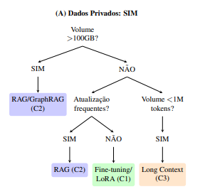
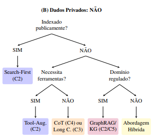
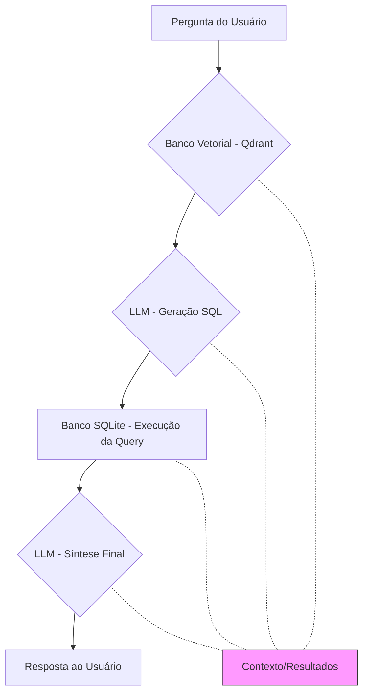

# 🎯 Framework de Decisão para Aprimoramento de LLMs

## RAG e Suas Alternativas: Um Guia Prático para Desenvolvedores

[](https://opensource.org/licenses/MIT)
[](https://www.python.org/downloads/)
[](https://www.google.com/search?q=LINK_DO_SEU_ARTIGO)
[](https://www.google.com/search?q=CONTRIBUTING.md)

> Um framework prático de decisão para escolher entre RAG, Fine-Tuning, Long Context e outras técnicas de aprimoramento de Grandes Modelos de Linguagem, com foco no contexto brasileiro.

[**Documentação Completa**](https://www.google.com/search?q=%23) | [**Estudo de Caso**](https://www.google.com/search?q=%23estudo-de-caso) | [**Framework Interativo**](https://www.google.com/search?q=%23framework-de-decis%C3%A3o) | [**Artigo Científico**](https://www.google.com/search?q=LINK)

-----

## 📋 Índice

  - [Sobre o Projeto](https://www.google.com/search?q=%23sobre-o-projeto)
  - [Quick Start](https://www.google.com/search?q=%23quick-start)
  - [Fundamentos da RAG](https://www.google.com/search?q=%23fundamentos-da-rag)
  - [Taxonomia de Técnicas (C1-C5)](https://www.google.com/search?q=%23taxonomia-temporal-c1-c5)
  - [Framework de Decisão](https://www.google.com/search?q=%23framework-de-decis%C3%A3o)
  - [Alternativas à RAG](https://www.google.com/search?q=%23alternativas-%C3%A0-rag)
  - [Validação do Framework](https://www.google.com/search?q=%23valida%C3%A7%C3%A3o-do-framework)
  - [Estudo de Caso](https://www.google.com/search?q=%23estudo-de-caso)
  - [Estrutura do Repositório](https://www.google.com/search?q=%23estrutura-do-reposit%C3%B3rio)
  - [Como Usar](https://www.google.com/search?q=%23como-usar)
  - [Contribuindo](https://www.google.com/search?q=%23contribuindo)
  - [Citação](https://www.google.com/search?q=%23cita%C3%A7%C3%A3o)
  - [Licença](https://www.google.com/search?q=%23licen%C3%A7a)

-----

## 🎯 Sobre o Projeto

### O Desafio

Grandes Modelos de Linguagem (LLMs) enfrentam limitações fundamentais:

  - **Conhecimento estático**: informações desatualizadas após o treinamento
  - **Ausência de dados especializados**: sem acesso a informações proprietárias ou de domínio específico
  - **Múltiplas soluções disponíveis**: RAG, Fine-Tuning, Long Context, Tool-Augmented... mas qual escolher?

### A Solução

Este repositório apresenta um **framework prático de decisão** que transforma o debate teórico sobre técnicas de aprimoramento de LLMs em uma ferramenta aplicável, especialmente relevante para a comunidade brasileira de IA.

### Principais Contribuições

✅ **Taxonomia Temporal (C1-C5)**: Classificação organizada das técnicas pelo momento de disponibilização do conhecimento ao modelo

✅ **Árvore de Decisão**: Guia visual para seleção técnica baseada em critérios objetivos

✅ **Matriz de Adequação**: Mapeamento de técnicas por cenários reais de aplicação

✅ **Validação Prática**: Análise comparativa de aplicações reais contra o framework proposto

✅ **Contexto Brasileiro**: Destaque para contribuições da comunidade SBC e aplicações nacionais

### Para Quem é Este Repositório?

  - **Arquitetos de Soluções**: Decisões fundamentadas sobre qual técnica usar
  - **Desenvolvedores**: Referência prática com código reproduzível
  - **Pesquisadores**: Base consolidada da literatura com foco em contribuições brasileiras
  - **Estudantes**: Material didático estruturado sobre aprimoramento de LLMs

-----

## ⚡ Quick Start

### Descubra Rapidamente Qual Técnica Usar

**Seus dados são privados/proprietários?**

  - ✅ **SIM** → Vá para a [Árvore de Decisão - Ramo A](https://www.google.com/search?q=%23framework-de-decis%C3%A3o)
  - ❌ **NÃO** → Vá para a [Árvore de Decisão - Ramo B](https://www.google.com/search?q=%23framework-de-decis%C3%A3o)

**Já sabe seu cenário?** Consulte a [Matriz de Adequação por Cenário](https://www.google.com/search?q=%23matriz-de-adequa%C3%A7%C3%A3o-t%C3%A9cnica-por-cen%C3%A1rio)

**Quer ver na prática?** Explore o [Estudo de Caso: Chatbot de Futebol](https://www.google.com/search?q=%23estudo-de-caso)

### Navegação Rápida por Categoria

| Categoria | O que é | Quando usar | Exemplos |
|-----------|---------|-------------|----------|
| [**C1**](https://www.google.com/search?q=%23categoria-1-internaliza%C3%A7%C3%A3o-de-conhecimento) | Modificação de pesos do modelo | Conhecimento estável, recursos disponíveis | Fine-Tuning, LoRA, QLoRA |
| [**C2**](https://www.google.com/search?q=%23categoria-2-recupera%C3%A7%C3%A3o-de-conhecimento-externo) | Busca em tempo real | Dados dinâmicos, atualizações frequentes | RAG, Tool-Augmented, GraphRAG |
| [**C3**](https://www.google.com/search?q=%23categoria-3-expans%C3%A3o-de-contexto) | Contexto massivo no prompt | Documentos completos, \<1M tokens | Long Context Models |
| [**C4**](https://www.google.com/search?q=%23categoria-4-otimiza%C3%A7%C3%A3o-de-racioc%C3%ADnio) | Melhoria do processamento | Problemas complexos, sem dados externos | Chain-of-Thought |
| [**C5**](https://www.google.com/search?q=%23categoria-5-protocolos-de-habilita%C3%A7%C3%A3o) | Infraestrutura de suporte | Fundação para outras categorias | Knowledge Graphs, MCP |

-----

## 📚 Fundamentos da RAG

### O que é Retrieval-Augmented Generation?

A Geração Aumentada por Recuperação (**RAG**) foi introduzida por Lewis et al. (2020) para superar a limitação de **conhecimento paramétrico estático** dos LLMs. A arquitetura combina um componente de recuperação densa com um modelo generativo, permitindo que o modelo acesse informações atualizadas sem necessidade de retreinamento.

### Arquitetura Original

A RAG fundamenta-se em três componentes principais:

1.  **Indexador**: Processa e armazena representações vetoriais de uma base de conhecimento externa
2.  **Recuperador**: Identifica documentos mais relevantes para uma consulta específica
3.  **Gerador**: Produz respostas utilizando tanto a consulta quanto os documentos recuperados como contexto

### Evolução Arquitetural

#### 2022: Integração Profunda

**RETRO (Retrieval-Enhanced Transformer)** - Borgeaud et al. incorporaram mecanismos de recuperação diretamente na arquitetura do transformer, permitindo acesso a trilhões de tokens.

#### 2023: Otimizações e Especializações

  - **Modelos de embedding especializados** por domínio
  - **Chunking semântico** preservando coerência contextual
  - **Busca híbrida** combinando similaridade semântica com filtros de metadados
  - **In-Context RAL** - Ram et al. propuseram atualização dinâmica via contexto estendido

### 📖 Artigos Seminais

| Ano | Trabalho | Contribuição | Link |
|-----|----------|--------------|------|
| 2020 | **Lewis et al.** - RAG | Arquitetura fundacional da RAG | [NeurIPS 2020](https://arxiv.org/abs/2005.11401) |
| 2021 | **Izacard & Grave** - FiD | Escalabilidade em QA | [TACL 2021](https://arxiv.org/abs/2007.01282) |
| 2022 | **Borgeaud et al.** - RETRO | Integração com transformer | [ICML 2022](https://arxiv.org/abs/2112.04426) |
| 2023 | **Ram et al.** - In-Context RAL | Contexto estendido dinâmico | [arXiv 2023](https://arxiv.org/abs/2302.00083) |
| 2023 | **Shi et al.** - LLM Retrievers | LLMs como recuperadores zero-shot | [arXiv 2023](https://arxiv.org/abs/2304.14233) |

-----

## 🇧🇷 Contribuições Brasileiras (SBC)

A partir de 2024, a comunidade acadêmica brasileira demonstrou assimilação e adaptação da RAG ao contexto nacional, com publicações em eventos da Sociedade Brasileira de Computação (**SBC**).

### Domínio Jurídico

**Arquiteturas RAG para Documentação Legal**

  - Paranhos et al. (2024) - Avaliação de padrões arquiteturais RAG em domínios jurídicos
      - [XII ERI-GO 2024](http://repositorio.bc.ufg.br/handle/ri/27276)
      - Desafios: complexidade terminológica e hierarquias normativas brasileiras

**Extração Automatizada de Dados Legais**

  - Aquino et al. (2024) - 90% de precisão em identificação de elementos jurídicos
      - [SBBD 2024](https://sol.sbc.org.br/index.php/sbbd_estendido/article/view/31268)

### Domínio Educacional

**Questões Multimodais do ENEM**

  - Taschetto & Fileto (2024) - RAG para processamento texto-imagem
      - [SBBD 2024](https://sol.sbc.org.br/index.php/sbbd/article/view/30233)
      - Relevância: especificidade cultural e linguística do sistema educacional brasileiro

**Assistentes Virtuais Institucionais**

  - Kuratomi et al. (2024) - Aumento de precisão de 13,68% para 54,02%
      - [ENIAC 2024](https://sol.sbc.org.br/index.php/eniac/article/view/31884)

  - Souza et al. (2024) - IFBot para instituições educacionais
      - [WICS 2024](https://sol.sbc.org.br/index.php/wics/article/view/31611)

### Contribuições Metodológicas

**TableRAG** - Souza et al. (2024)

  - Pipeline especializado para dados tabulares
  - 86,7% eficácia em recuperação | 74% acurácia em QA sobre tabelas
  - [STIL 2024](https://sol.sbc.org.br/index.php/stil/article/view/31349)

**Estudos Comparativos**

  - da Costa et al. (2024) - Comparação Fine-Tuning vs RAG para tarefas em português
      - [STIL 2024](https://sol.sbc.org.br/index.php/stil/article/view/31350)

**Implementação Local**

  - Rocha & Pessoa (2024) - Análise crítica de limitações em LLMs locais
      - [ENIAC 2024](https://sol.sbc.org.br/index.php/eniac/article/view/31880)
      - Foco: soberania tecnológica no contexto brasileiro

### Aplicações Empresariais

  - Siqueira et al. (2024) - Integração de dados estruturados em chatbots empresariais
      - [STIL 2024](https://sol.sbc.org.br/index.php/stil/article/view/31348)

-----

## 🗂️ Taxonomia Temporal: Categorias C1-C5

A classificação organiza as técnicas de aprimoramento segundo o **momento em que o conhecimento é disponibilizado ao modelo**, estruturadas em uma linha temporal do treinamento à infraestrutura de suporte.

-----

### Categoria 1: Internalização de Conhecimento (no Treino)

**Momento**: Modificação dos pesos do modelo antes da inferência

Técnicas que incorporam conhecimento de forma permanente através do ajuste de parâmetros.

| Técnica | Descrição | Quando Usar |
|---------|-----------|-------------|
| **Fine-Tuning Completo** | Retreinamento de todos os parâmetros | Especialização profunda com recursos abundantes |
| **LoRA** (Low-Rank Adaptation) | Adaptação de baixo rank, modificando subconjuntos | Especialização eficiente com recursos limitados |
| **QLoRA** (Quantized LoRA) | LoRA com quantização para ainda mais eficiência | Dispositivos edge ou ambientes com restrições severas |

**Vantagens**

  - ✅ Independência de infraestrutura externa na inferência
  - ✅ Latência reduzida (sem busca em tempo real)
  - ✅ Privacidade total dos dados

**Limitações**

  - ❌ Custos elevados para atualizações frequentes
  - ❌ Risco de catastrophic forgetting
  - ❌ Inadequado para informações altamente dinâmicas

**Referências**: [Howard & Ruder, 2018](https://arxiv.org/abs/1801.06146) | [Hu et al., 2022](https://arxiv.org/abs/2106.09685) | [Dettmers et al., 2023](https://arxiv.org/abs/2305.14314)

-----

### Categoria 2: Recuperação de Conhecimento Externo (Tempo Real)

**Momento**: Acesso a fontes externas durante a inferência

Paradigma "just-in-time knowledge" - a categoria mais ampla da taxonomia.

| Técnica | Descrição | Caso de Uso Ideal |
|---------|-----------|-------------------|
| **RAG Tradicional** | Recuperação densa + geração contextual | Bases internas extensas, atualizações frequentes |
| **Hybrid Retrieval** | Busca densa (semântica) + esparsa (BM25) | Máxima cobertura e precisão em grandes volumes |
| **GraphRAG** | Integração com grafos de conhecimento | Navegação relacional e raciocínio multi-hop |
| **Search-First** | APIs de busca externa direta | Informações públicas, sem infraestrutura própria |
| **Tool-Augmented** | LLM chama ferramentas especializadas | Acesso a APIs, calculadoras, bancos de dados |
| **Neuro-Simbólico** | Recuperação neural + raciocínio simbólico | Domínios que exigem garantias lógicas formais |

**Vantagens**

  - ✅ Máxima flexibilidade para dados dinâmicos
  - ✅ Atualização sem retreinamento
  - ✅ Acesso a conhecimento especializado sob demanda

**Limitações**

  - ❌ Complexidade operacional
  - ❌ Dependência de infraestrutura externa
  - ❌ Latência adicional na recuperação

**Referências**: [Lewis et al., 2020](https://arxiv.org/abs/2005.11401) | [Ma et al., 2021](https://arxiv.org/abs/2104.08663) | [Edge et al., 2024](https://arxiv.org/abs/2404.16130) | [Qin et al., 2023](https://arxiv.org/abs/2307.16789)

-----

### Categoria 3: Expansão da Janela de Contexto

**Momento**: Fornecimento do conhecimento completo no prompt

Abordagem de "força bruta" viabilizada por avanços arquiteturais recentes.

| Subcategoria | Descrição | Exemplo |
|--------------|-----------|---------|
| **C3A - Expansão Passiva** | Usuário fornece manualmente todo o contexto | Upload de documentos completos |
| **C3B - Expansão Ativa** | Modelo gerencia contexto automaticamente | Sistemas emergentes com gerenciamento autônomo |

**Modelos Disponíveis**: Gemini 1.5 (1M+ tokens), Claude (1M+ tokens)

**Vantagens**

  - ✅ Simplicidade arquitetural (sem chunking)
  - ✅ Compreensão holística de documentos
  - ✅ Sem infraestrutura de recuperação

**Limitações**

  - ❌ Volume total limitado pela janela
  - ❌ Custos elevados por token
  - ❌ Inadequado para bases massivas (\>1M tokens)

-----

### Categoria 4: Otimização do Raciocínio

**Momento**: Durante a inferência, na estruturação do prompt

Técnicas que melhoram o processamento da informação existente, sem adicionar conhecimento novo.

| Técnica | Descrição | Aplicação Ideal |
|---------|-----------|-----------------|
| **Chain-of-Thought (CoT)** | Raciocínio passo a passo explícito | Problemas matemáticos e lógicos complexos |
| **Prompting Avançado** | Estruturação estratégica de instruções | Decomposição de tarefas complexas |

**Vantagens**

  - ✅ Baixo custo de implementação
  - ✅ Sem infraestrutura adicional
  - ✅ Complementar a outras categorias

**Limitações**

  - ❌ Limitado ao conhecimento paramétrico
  - ❌ Não resolve obsolescência de dados

**Referências**: [Wei et al., 2022](https://arxiv.org/abs/2201.11903)

-----

### Categoria 5: Protocolos e Frameworks de Habilitação

**Momento**: Define a infraestrutura sobre a qual o sistema opera

Não são técnicas de aprimoramento direto, mas habilitam outras categorias.

| Protocolo | Função | Habilita |
|-----------|--------|----------|
| **Knowledge Graphs** | Ontologias formais com garantias lógicas | GraphRAG, Neuro-Simbólico |
| **Model Context Protocol (MCP)** | Descoberta e uso autônomo de ferramentas | Tool-Augmented Generation em escala |

**Características**

  - 🔧 Infraestrutura de suporte
  - 🔧 Auditabilidade e rastreabilidade
  - 🔧 Padronização de interfaces

**Referências**: [Ji et al., 2022](https://ieeexplore.ieee.org/document/9416312)

-----

## 🎯 Framework de Decisão

### Árvore de Decisão

A árvore orienta a seleção técnica através de perguntas sequenciais sobre características fundamentais do problema:

**Ramo A - Dados Privados/Proprietários**



**Ramo B - Dados Públicos**



### Tabela Comparativa Multidimensional

| Técnica | Volume | Freq. Atual. | Privacidade | Recursos | Latência | Orçamento | Expertise |
|---------|--------|--------------|-------------|----------|----------|-----------|-----------|
| **RAG Tradicional** | Grande | Alta | Configurável | Médio-Alto | Média | Médio-Alto | Médio |
| **Fine-tuning** | Médio-Grande | Baixa | Total | Alto | Baixa | Alto (CAPEX) | Alto |
| **LoRA/QLoRA** | Pequeno-Médio | Baixa | Total | Médio | Baixa | Médio | Médio |
| **Long Context** | Pequeno (\<1M) | N/A\* | Variável | Médio | Média | Alto (OPEX) | Baixo-Médio |
| **Search-First** | Ilimitado\*\* | Máxima | Limitada | Baixo | Média | Baixo-Médio | Baixo |
| **Tool-Augmented** | Configurável | Alta | Configurável | Médio | Variável | Médio | Médio-Alto |
| **GraphRAG** | Médio | Média | Configurável | Alto | Alta | Alto | Alto |
| **Chain-of-Thought** | N/A\*\*\* | Baixa | Total | Baixo | Baixa | Baixo | Baixo-Médio |
| **Knowledge Graphs** | Médio | Baixa | Total | Médio | Baixa | Alto | Alto |
| **Neuro-Simbólico** | Médio | Baixa | Total | Alto | Média | Alto | Muito Alto |
| **Hybrid Retrieval** | Grande | Alta | Configurável | Alto | Média | Alto | Alto |

**Legenda**:

  - \*N/A: Depende da fonte de contexto fornecida
  - \*\*Limitado apenas por disponibilidade pública de informações
  - \*\*\*Opera sobre conhecimento paramétrico existente

-----

### Matriz de Adequação Técnica por Cenário

| Cenário de Aplicação | Técnica Primária | Justificativa | Alternativas Complementares |
|---------------------|------------------|---------------|----------------------------|
| **Suporte ao Cliente** | RAG Tradicional (C2) | Bases internas extensas requerem precisão factual e atualização dinâmica | Tool-Augmented (C2) para integração com CRM e sistemas transacionais |
| **Conformidade Regulatória** | GraphRAG (C2) | Navegação em hierarquias normativas com rastreabilidade de fontes legais | Fine-tuning (C1) quando terminologia é específica e estável |
| **Pesquisa Acadêmica** | Hybrid Retrieval (C2) | Maximiza cobertura e precisão em grandes volumes de literatura | Long Context (C3) para análise holística de artigos individuais |
| **Desenvolvimento de Software** | Tool-Augmented (C2) | Integração com ferramentas especializadas (linters, testes, docs) | RAG Tradicional (C2) para repositórios com patterns específicos |
| **Aplicações Mobile/Edge** | LoRA/QLoRA (C1) | Execução local eficiente com recursos limitados e privacidade | Chain-of-Thought (C4) para raciocínio sem infraestrutura adicional |
| **Análise de Documentos Legais** | GraphRAG (C2) | Hierarquias normativas brasileiras complexas | Knowledge Graphs (C5) para auditabilidade completa |
| **Chatbots Educacionais** | RAG Tradicional (C2) | Conteúdo institucional dinâmico, atualizações frequentes | Long Context (C3) para materiais didáticos extensos |
| **Assistentes Médicos** | Neuro-Simbólico (C2) | Garantias lógicas formais, rastreabilidade de raciocínio | GraphRAG (C2) para bases de conhecimento médico |

-----

## 🔬 Estudo de Caso: Chatbot para o Campeonato Brasileiro

### Contexto e Motivação

**Domínio**: Campeonato Brasileiro de Futebol Série A

**Objetivo**: Fornecer respostas precisas sobre partidas, estatísticas de jogadores e classificações em tempo real.

**Desafios Identificados**:

1.  Dados inerentemente dinâmicos (atualizações diárias/semanais)
2.  Informações estruturadas em formato tabular (artilharia, resultados, classificações)
3.  Conhecimento paramétrico dos LLMs não inclui eventos recentes
4.  Dados tabulares não são nativos ao conhecimento dos modelos

### Decisão Arquitetural

**Técnica Escolhida**: Tool-Augmented RAG (Categoria C2) - Padrão Text-to-SQL

**Justificativa pela Taxonomia**:

  - ✅ Dados estruturados (SQL) + dinâmicos (atualizações frequentes) → C2
  - ✅ Necessidade de acesso a ferramentas especializadas (banco de dados)
  - ✅ Precisão factual crítica (estatísticas esportivas)

### Arquitetura Implementada



### Componentes Técnicos

**1. Banco de Dados Vetorial (Qdrant)**

Armazena três tipos de informações recuperáveis:

  - **Esquemas de Tabelas**: Trechos dos `CREATE TABLE` relevantes
  - **Documentação Semântica**: Descrições em linguagem natural de tabelas e colunas
  - **Exemplos Few-Shot**: Pares "pergunta-SQL" validados

**2. Pipeline de Recuperação**

```python
# Exemplo conceitual do fluxo
pergunta = "Quem fez mais gols no Brasileirão?"

# Busca vetorial retorna:
contexto = {
    "esquema": "CREATE TABLE artilharia (jogador TEXT, gols INTEGER, ...)",
    "docs": "A tabela artilharia contém estatísticas de gols por jogador",
    "exemplos": [
        {"Q": "Quantos gols tem o Pedro?", "SQL": "SELECT gols FROM..."}
    ]
}

# LLM gera SQL contextualizado
sql_gerado = llm.generate(pergunta, contexto)
```

**3. Validação e Resultados**

Dataset de validação contendo:

  - Perguntas em linguagem natural
  - SQL de referência correspondente
  - Resultado esperado

**Dificuldades Iniciais**:

  - ❌ Lógica temporal complexa (datas)
  - ❌ Sequências (vitórias consecutivas)
  - ❌ Perguntas compostas

**Melhorias Implementadas**:

  - ✅ Enriquecimento do banco vetorial com mais exemplos
  - ✅ Documentação detalhada de casos edge
  - ✅ Geração de SQL idêntico ao de referência para perguntas diversas

**Alinhamento com o Framework**

| Critério | Avaliação | Confirmação da Escolha |
|---------|-----------|------------------------|
| Volume de Dados | Médio (tabelas estruturadas) | ✅ C2 adequado |
| Frequência de Atualização | Alta (jogos semanais) | ✅ C2 necessário |
| Privacidade | Dados públicos | ✅ C2 sem restrições |
| Recursos Computacionais | Médios | ✅ RAG mais eficiente que Fine-tuning |
| Latência | Média aceitável | ✅ Tool-Augmented viável |
| Especialização | Domínio específico mas dinâmico | ✅ C2 \> C1 (dados mudam constantemente) |

**Código e Documentação Completa**

O desenvolvimento completo deste estudo de caso está documentado no trabalho de conclusão de curso:
ROSA, Evellyn Nicole Machado. Automatização de consultas SQL com Retrieval-Augmented Generation (RAG): uma abordagem para a conversão de texto aplicada a dados do campeonato brasileiro. 2025. 99 f. Trabalho de Conclusão de Curso (Bacharelado em Inteligência Artificial) - Instituto de Informática, Universidade Federal de Goiás, Goiânia, 2024.

📄 Acesso ao TCC Completo | 🔗 Repositório de Código

**Lições Aprendidas**

  - **Tool-Augmented RAG é eficaz para dados estruturados dinâmicos**

      - Combina flexibilidade da RAG com precisão de consultas estruturadas

  - **Qualidade da recuperação é crítica**

      - Exemplos few-shot e documentação semântica melhoram significativamente a geração

  - **Validação iterativa é essencial**

      - Dataset de validação permitiu identificar e corrigir casos edge

  - **Framework confirmado na prática**

      - Decisão por C2 (Tool-Augmented) alinhada com características do problema

## 🚀 Como Usar Este Repositório

### Para Arquitetos de Soluções

**Objetivo**: Escolher a técnica adequada para seu projeto

1.  **Identifique as características do seu problema**

      - Volume de dados a processar
      - Frequência de atualização necessária
      - Requisitos de privacidade
      - Recursos computacionais disponíveis

2.  **Consulte a Árvore de Decisão**

      - Siga o fluxo de perguntas em [`assets/decision_tree.png`](https://www.google.com/search?q=assets/decision_tree.png)
      - Ou use a versão textual em [`framework_materials/decision_flowchart.md`](https://www.google.com/search?q=framework_materials/decision_flowchart.md)

3.  **Valide com a Matriz de Cenários**

      - Encontre cenários similares em [Matriz de Adequação Técnica por Cenário](https://www.google.com/search?q=%23matriz-de-adequa%C3%A7%C3%A3o-t%C3%A9cnica-por-cen%C3%A1rio)
      - Compare com a [Tabela Comparativa Multidimensional](https://www.google.com/search?q=%23tabela-comparativa-multidimensional)

4.  **Consulte o Estudo de Caso**

      - Veja implementação prática em [`case_studies/`](https://www.google.com/search?q=case_studies/)

### Para Desenvolvedores

**Objetivo**: Implementar a técnica escolhida

1.  **Estude a categoria selecionada**

      - Leia a documentação da categoria (C1-C5)
      - Revise as referências acadêmicas citadas

2.  **Analise o código de exemplo**

      - Explore o estudo de caso em [`case_studies/chatbot_futebol/`](https://www.google.com/search?q=case_studies/chatbot_futebol/)
      - Consulte o [TCC completo da Evellyn](http://repositorio.bc.ufg.br//handle/ri/27277)

3.  **Adapte para seu contexto**

      - Use a arquitetura como referência
      - Considere as lições aprendidas documentadas

### Para Pesquisadores

**Objetivo**: Fundamentação teórica e referências

1.  **Revisão bibliográfica**

      - [Fundamentos da RAG](https://www.google.com/search?q=%23fundamentos-da-rag): artigos seminais
      - [Contribuições Brasileiras](https://www.google.com/search?q=%23-contribui%C3%A7%C3%B5es-brasileiras-sbc): trabalhos SBC

2.  **Framework acadêmico**

      - Taxonomia conceitual em [`docs/taxonomia_detalhada.md`](https://www.google.com/search?q=docs/taxonomia_detalhada.md)
      - Artigo completo em [`docs/artigo_completo.pdf`](https://www.google.com/search?q=docs/artigo_completo.pdf)

3.  **Citação do trabalho**

      - Veja [Como Citar](https://www.google.com/search?q=%23cita%C3%A7%C3%A3o)

### Para Estudantes

**Objetivo**: Aprendizado estruturado

**Caminho recomendado**:

1.  Comece com [Sobre o Projeto](https://www.google.com/search?q=%23%F0%9F%8E%AF-sobre-o-projeto)
2.  Leia [Fundamentos da RAG](https://www.google.com/search?q=%23%F0%9F%93%9A-fundamentos-da-rag)
3.  Explore a [Taxonomia C1-C5](https://www.google.com/search?q=%23%F0%9F%97%82%EF%B8%8F-taxonomia-temporal-categorias-c1-c5)
4.  Pratique com o [Estudo de Caso](https://www.google.com/search?q=%23%F0%9F%94%AC-estudo-de-caso-chatbot-para-o-campeonato-brasileiro)
5.  Teste sua compreensão usando o [Framework de Decisão](https://www.google.com/search?q=%23%F0%9F%8E%AF-framework-de-decis%C3%A3o)

-----

### Bibliografia Chave Utilizada

  * Aquino, I. V. d., Santos, M. M. d., Dorneles, C. F., and Carvalho, J. T. (2024). *Extracting information from brazilian legal documents with retrieval augmented generation.*
  * Borgeaud, S. et al. (2022). *Improving language models by retrieving from trillions of tokens.*
  * da Costa, L. Y. et al. (2024). *A comparative study of fine-tuning and rag strategies for portuguese qa tasks.*
  * Howard, J. and Ruder, S. (2018). *Universal language model fine-tuning for text classification.*
  * Kuratomi, G., Pirozelli, P., Cozman, F., and Peres, S. M. (2024). *A rag-based institutional assistant.*
  * Lewis, P. et al. (2020). *Retrieval-augmented generation for knowledge-intensive nlp tasks.*
  * Paranhos, S. L. et al. (2024). *Avaliação do impacto de diferentes padrões arquiteturais rag em domínios jurídicos.*
  * Souza, E. A. d. et al. (2024a). *Tablerag: A novel approach for augmenting Ilms with information from retrieved tables.*
  * Taschetto, L. d. C. and Fileto, R. (2024). *Using retrieval-augmented generation to improve performance of large language models on the brazilian university admission exam (enem).*
  * Wei, J. et al. (2022). *Chain-of-thought prompting elicits reasoning in large language models.*